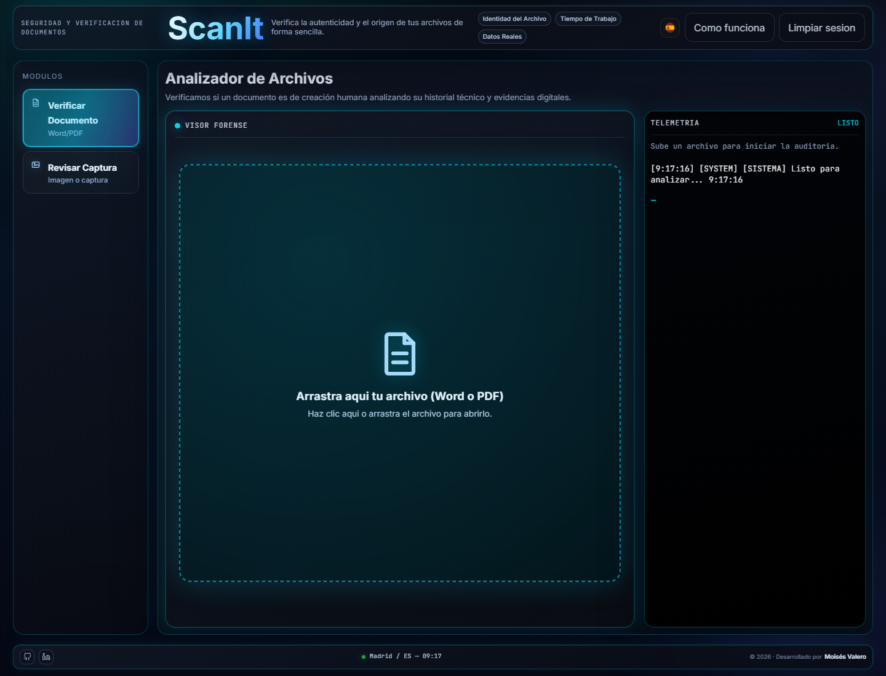
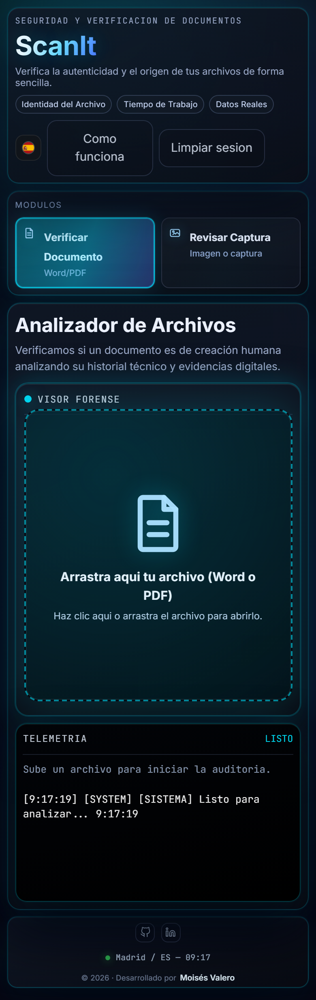

# ScanIt

**Forensic document and image verification interface built with SvelteKit.**

ScanIt is a web app for auditing whether a PDF, Word document, image, or screenshot shows technical signs of manipulation, synthetic generation, or inconsistent origin metadata. It is designed as a practical product prototype: a recruiter can open it, understand the workflow, inspect the code, and see a complete frontend/backend pipeline rather than a static landing page.


## Screenshots

### Desktop forensic workspace



### Responsive mobile layout



### Footer with repository link


## Why Recruiters Should Look At This

ScanIt is not a template reskin. It demonstrates product thinking, SvelteKit implementation, API design, file analysis, AI integration, and quality tooling in one project.

What this project shows:

- **Frontend engineering:** responsive Svelte 5 UI, stateful analysis workflow, telemetry panel, modals, upload surfaces, and polished interaction states.
- **Backend/API work:** SvelteKit API endpoints for document and image analysis with structured JSON responses.
- **File-processing pipeline:** PDF, DOCX, image, metadata, OCR, hash, and anomaly checks.
- **AI integration:** Groq-powered linguistic and visual classification used as one evidence source, not as a blind final decision.
- **Risk-aware product logic:** conservative verdict policy with explicit `no_concluyente` output when evidence is missing or contradictory.
- **Quality discipline:** project-level formatting, linting, Svelte checks, tests, build validation, and dependency audit.

## Product Summary

ScanIt answers one question:

> Are there technical signs that this file was manipulated, generated, or is inconsistent with its claimed origin?

The app avoids pretending that detection is perfect. Instead, it combines available evidence and reports confidence, anomalies, and coverage. When evidence is not strong enough, the system prefers an inconclusive result over an overconfident claim.

## Core Features

- Upload and audit `.pdf` and `.docx` files.
- Review image or screenshot evidence.
- Extract document text, metadata, timeline signals, and structural indicators.
- Calculate hashes and technical markers for traceability.
- Detect suspicious document timing, authorship, linguistic, and structure patterns.
- Run visual checks for image evidence.
- Generate operational telemetry while the audit runs.
- Produce technical PDF reports.
- Support multilingual UI content.

## Technical Highlights

### Document audit

The document endpoint processes file structure and content through several evidence layers:

- DOCX metadata and internal file structure.
- PDF text extraction and structural checks.
- Creation/modification timeline consistency.
- Text statistics such as lexical diversity and writing-rate indicators.
- Optional AI-assisted linguistic review when enough text is available.
- Final verdict based on evidence coverage and conservative thresholds.

### Image audit

The image path focuses on whether the uploaded visual evidence is relevant and technically suspicious:

- Visual classification for document/screenshot relevance.
- Noise and compression consistency checks.
- Evidence-oriented response instead of a single opaque score.

### UI and UX

The interface is built as a real working tool:

- Desktop layout with modules, forensic viewer, and telemetry.
- Mobile-friendly responsive flow.
- Persistent footer links to GitHub and LinkedIn.
- Clear upload states and operational logs.
- Dark forensic visual language suited to the product domain.

## Stack

- **Framework:** SvelteKit 2 + Svelte 5
- **Language:** TypeScript
- **Build:** Vite
- **Document processing:** `mammoth`, `jszip`, `pdfjs-dist`, `pdf-parse`
- **OCR:** `tesseract.js`
- **AI:** `groq-sdk`
- **Reports:** `jspdf`
- **Quality:** Prettier, `svelte-check`, strict warning-free lint script

## Quality Status

Current project checks:

```bash
pnpm run format:check
pnpm run lint
pnpm test
pnpm run check
pnpm run build
pnpm audit
```

Expected status:

- Formatting: pass
- Svelte diagnostics: `0 errors / 0 warnings`
- Tests: pass
- Build: pass
- Audit: `0 vulnerabilities`

## Quick Start

```bash
pnpm install
pnpm run dev
```

Open:

```txt
http://127.0.0.1:5173
```

The Vite dev server is intentionally fixed to `127.0.0.1:5173` with `strictPort: true`.

## Environment Variables

Minimal local configuration:

```bash
GROQ_API_KEY=your_api_key
PUBLIC_SITE_URL=http://localhost:5173
```

Optional document-audit controls:

```bash
SCANIT_SAFE_MODE=false
SCANIT_PDF_LINGUISTIC_DECISIVE_MIN=90
SCANIT_PDF_INTEGRO_MAX_WORDS_IF_LINGUISTIC_ERROR=600
```

## Useful Scripts

```bash
pnpm run dev            # local development server
pnpm run format:check   # verify Prettier formatting
pnpm run lint           # svelte-check with fail-on-warnings
pnpm test               # current test gate
pnpm run check          # SvelteKit sync + svelte-check
pnpm run build          # production build
pnpm run eval:dataset   # dataset evaluation script
```

## Repository Structure

```txt
src/routes/+page.svelte                    Main ScanIt interface
src/routes/api/audit-document/+server.ts   Document forensic API
src/routes/api/audit-image-ai/+server.ts   Image relevance / AI API
src/lib/components/Scanner/                Scanner UI components
src/lib/forensics/                         Forensic signal helpers
src/lib/ensemble/                          Evidence aggregation logic
scripts/eval-dataset.mjs                   Dataset evaluation runner
docs/screenshots/                          README screenshots
```

## Verdict Policy

ScanIt uses a conservative decision model:

- `integro`: evidence is consistent and coverage is sufficient.
- `anomalias_detectadas`: relevant technical anomalies are present.
- `no_concluyente`: evidence is incomplete, weak, or contradictory.

This is deliberate. The product is built to reduce false confidence and make the reasoning behind each result visible.

## Deployment Notes

Recommended deployment path:

1. Push the repository to GitHub.
2. Import the project into Vercel as a SvelteKit app.
3. Configure `GROQ_API_KEY`, `PUBLIC_SITE_URL`, and optional `SCANIT_*` variables.
4. Run the production build.

## License

This project is licensed under **PolyForm Noncommercial 1.0.0**. See [LICENSE](LICENSE).

Commercial use requires a separate commercial agreement with the author.

## Responsible Use

ScanIt is a technical verification and decision-support tool. It does not replace human review, formal forensic assessment, legal advice, or institutional policy.
